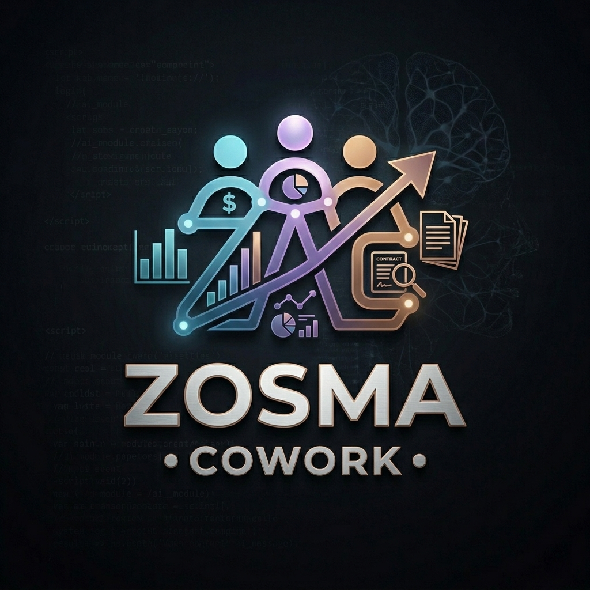
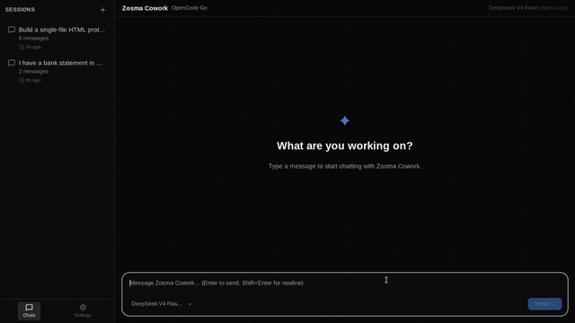

<div align="center">

# Zosma Cowork 🇮🇳



<a href="./README.md">English</a> | <a href="./README.zh.md">中文</a> | <a href="./README.es.md">Español</a> | <a href="./README.ja.md">日本語</a> | <a href="./README.de.md">Deutsch</a> | <a href="./README.fr.md">Français</a> | **Português** | <a href="./README.ru.md">Русский</a> | <a href="./README.ko.md">한국어</a> | <a href="./README.hi.md">हिंदी</a>

[](https://github.com/zosmaai/zosma-cowork/actions/workflows/ci.yml)
[](https://github.com/zosmaai/zosma-cowork/releases/latest)
[](https://opensource.org/licenses/MIT)
[](https://discord.gg/c5vadsv9)
[](https://github.com/zosmaai/zosma-cowork/stargazers)

</div>

<br/>

<div align="center">
  <a href="https://github.com/zosmaai/zosma-cowork/stargazers">
    
  </a>
  <br/>
  <sub>
    If you find Zosma Cowork useful,
    <a href="https://github.com/zosmaai/zosma-cowork">⭐ star the repo</a> —
    it lets us know we're building something that matters.
  </sub>
</div>

<br/>

> Um harness de trabalho agentivo de desktop construído sobre [pi](https://github.com/earendil-works/pi-coding-agent), o harness de agente de codificação mínimo e agnóstico a linguagem. Streaming, pensamento, chamadas de ferramentas, sessões multi-turno — tudo gratuito, tudo open-source, tudo local.
>
> Construído por [Zosma AI](https://zosma.ai).

## Gallery




*Invoice processing with natural language agents. See more demos at [zosma.ai/zosma-cowork/gallery](https://www.zosma.ai/zosma-cowork/gallery)*

## Por que Zosma Cowork?

### 🌟 Construído sobre pi

Zosma Cowork é um aplicativo de desktop construído sobre [pi](https://github.com/earendil-works/pi-coding-agent) — o harness de agente de codificação mínimo e agnóstico a linguagem. Cada extensão pi funciona diretamente, sem wrappers ou adaptadores.

### 🆓 Gratuito e Open Source

Zosma Cowork é **100% gratuito e open-source** (MIT). Traga sua própria chave de API ou use modelos locais — você mantém o controle.

### 🧩 Ecossistema Completo de Extensões pi

O [ecossistema pi](https://github.com/earendil-works/pi-coding-agent) inclui centenas de extensões, habilidades, ferramentas, prompts e temas — todos compatíveis com Zosma Cowork. Coloque-os no diretório `~/.zosmaai/cowork/` e eles funcionam imediatamente.

## Recursos
- **Sidecar agente Node.js** — O SDK pi-mono TypeScript roda em um processo sidecar gerenciado para capacidades completas de agente
- **Relé Tauri leve** — A camada Rust é uma ponte IPC mínima entre React e o sidecar
- **Ecossistema de extensões pi** — Compatível com extensões pi via `DefaultResourceLoader` — habilidades, ferramentas e prompts autodescobertos
- **Sessões multi-turno** — Continuidade completa de conversação com histórico persistente
- **Respostas em streaming** — Veja o agente pensar, escrever e chamar ferramentas em tempo real
- **Blocos de pensamento** — Raciocínio expansível do modelo
- **Linha do tempo de chamadas de ferramentas** — Chamadas ao vivo bash/edit/write com argumentos e resultados
- **Gerenciamento de sessões** — Sessões de chat persistentes salvas em `~/.zosmaai/cowork/`
- **Modo claro e escuro** — Modo claro creme quente, modo escuro carvão quente
- **Atalhos de teclado** — `Cmd/Ctrl+Shift+K` para foco, `Cmd/Ctrl+N` para nova sessão
- **Abortar e direcionar** — Pare um agente em execução, envie mensagens de direcionamento
- **UI inspirada no Claude** — Layout de 3 colunas com barra lateral, espaço de trabalho e painel de informações

## Arquitetura


<details>
<summary>Editar este diagrama</summary>

O diagrama é gerado a partir de <code>assets/architecture.mmd</code>. Para atualizar:

```bash
# Edit assets/architecture.mmd, then re-render:
mmdc -i assets/architecture.mmd -o assets/architecture.png -b white -w 900 -H 700
```
</details>

## Stack Tecnológico

| Layer | Technology |
|-------|-----------|
| Frontend | React 19, Tailwind CSS v4, Radix UI |
| Shell Desktop | Tauri v2, Rust, Tokio |
| Motor do Agente | Sidecar Node.js — `@earendil-works/pi-coding-agent` (pi-mono SDK) |
| Testes | Vitest, Testing Library, jsdom |
| Linting | Biome (frontend), Clippy (Rust) |

## Desenvolvimento

### Prerequisites

- [Node.js](https://nodejs.org/) 22+
- [Rust](https://rustup.rs/) 1.85+ (para o shell Tauri)

### Quick Start

```bash
# Install frontend dependencies
npm install

# Install agent-sidecar dependencies
cd agent-sidecar && npm install && cd ..

# Run frontend dev server
npm run dev:frontend

# Run full Tauri app (frontend + Rust relay + Node.js sidecar)
npm run dev
```

### Scripts

```bash
# Frontend
npm run lint          # Biome lint
npm run typecheck     # TypeScript check
npm run test          # Vitest run
npm run validate      # lint + typecheck + test
npm run format        # Biome format

# Tauri
npm run build:frontend
npm run build         # Build release binary

# Agent Sidecar
cd agent-sidecar
npm run build         # TypeScript → JavaScript
npm run dev           # tsx watch (standalone development)

# Rust (Tauri relay only)
cargo fmt --all --check
cargo clippy --workspace -- -D warnings
```

## Configuração e Dados

| O quê | Localização | Notas |
|------|----------|-------|
| Provedores LLM e chaves API | `~/.zosmaai/cowork/auth.json` | Gerenciado pelo app |
| Definições de modelo | `~/.zosmaai/cowork/models.json` | Gerenciado pelo app |
| Extensões e habilidades | `~/.zosmaai/cowork/extensions/` | Extensões compatíveis com Pi |
| Histórico de sessões | `~/.zosmaai/cowork/` | Gerenciado por Zosma Cowork |

## Protocolo IPC

O relé Tauri se comunica com o sidecar Node.js via linhas JSON stdin/stdout:

**Comandos (→ sidecar):**

| Command | Description |
|---------|-------------|
| `init` | Inicializar agente com configuração zosmaDir |
| `get_models` | Listar modelos disponíveis de todos os provedores |
| `prompt` | Enviar mensagem do usuário, transmitir eventos |
| `abort` | Cancelar prompt em execução |
| `set_model` | Trocar modelo ativo |
| `save_auth` | Salvar chave API para um provedor |
| `reload` | Reinicializar com extensões/auth atualizadas |

**Eventos (← sidecar):**

| Event | UI Effect |
|-------|-----------|
| `ready` | Modelos carregados, habilitar UI |
| `event` | Eventos de sessão do agente (pensamento, texto, chamadas de ferramentas) |
| `done` | Prompt concluído |
| `result` | Resposta a um comando de requisição |
| `error` | Erro com mensagem |

## Estrutura do Projeto

```
zosma-cowork/
├── agent-sidecar/                # Node.js agent process
│   └── src/
│       └── index.ts              # Sidecar: pi-mono SDK, stdin/stdout protocol
├── src/                          # React frontend
│   ├── components/               # UI components
│   │   ├── ChatMessage.tsx       # Message with thinking + tool calls
│   │   ├── ThinkingBlock.tsx     # Expandable reasoning
│   │   ├── ToolCallTimeline.tsx  # Tool execution timeline
│   │   ├── MessageInput.tsx      # Chat input
│   │   └── ui/                   # Primitives (tooltip, badge, etc.)
│   ├── hooks/
│   │   ├── usePiStream.ts        # Streaming state machine (useReducer)
│   │   └── useSessions.ts        # Session persistence
│   ├── types/
│   │   ├── index.ts              # ChatMessage, ToolCallInfo
│   │   └── pi-events.ts          # CoworkEvent types
│   ├── App.tsx                   # Main 3-column layout
│   └── App.css                   # Tailwind theme (light + dark)
├── src-tauri/                    # Tauri desktop shell (thin Rust relay)
│   └── src/
│       ├── main.rs               # Entry point
│       └── lib.rs                # IPC commands → sidecar process
├── docs/                         # Architecture & plans
└── .github/workflows/            # CI/CD
```

---

## Star History

<a href="https://star-history.com/#zosmaai/zosma-cowork&Date">
  <picture>
    <source media="(prefers-color-scheme: dark)" srcset="https://api.star-history.com/svg?repos=zosmaai/zosma-cowork&type=Date&theme=dark" />
    <source media="(prefers-color-scheme: light)" srcset="https://api.star-history.com/svg?repos=zosmaai/zosma-cowork&type=Date" />
    
  </picture>
</a>

## Contributors

<a href="https://github.com/zosmaai/zosma-cowork/graphs/contributors">
  
</a>

---

## 🇮🇳 Feito na Índia

**Zosma Cowork** — construído **da Índia** por **ZOSMAAI SOLUTIONS PRIVATE LIMITED**.

## Licença

MIT © [Zosma AI](https://zosma.ai)
